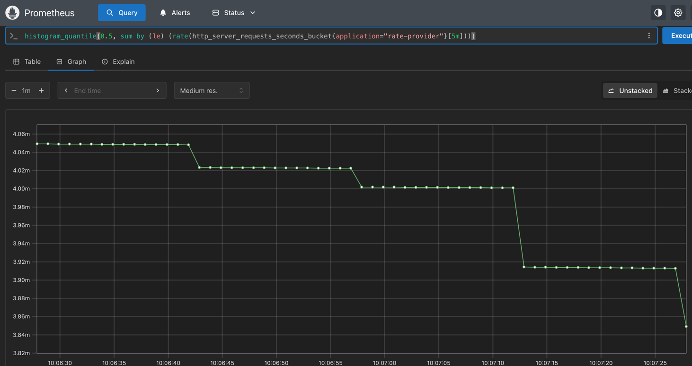
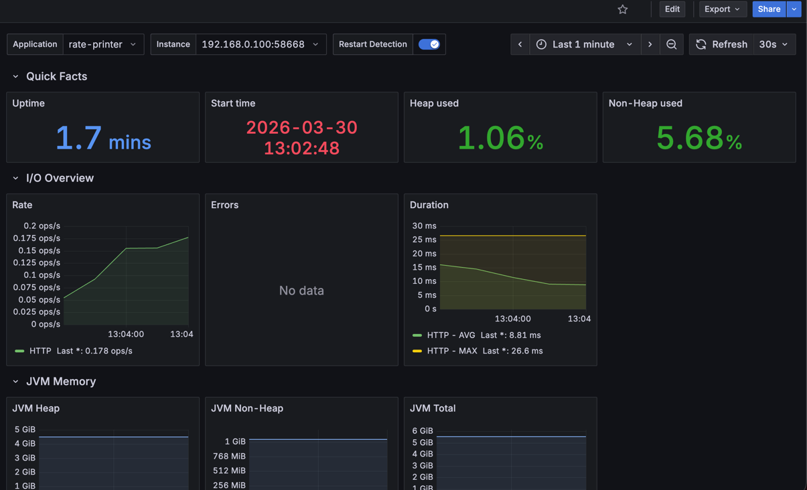

# currency-rate

## Запуск

```bash
./start.sh
```

По умолчанию `start.sh` запускает:

- `2` инстанса `rate-provider`
- `2` инстанса `rate-printer`

на случайных свободных портах (`--server.port=0`).

Можно задать количество инстансов:

```bash
PROVIDER_INSTANCES=3 PRINTER_INSTANCES=1 ./start.sh
```

После запуска:

- Consul: [http://localhost:8500](http://localhost:8500)
- Pact Broker: [http://localhost:9292](http://localhost:9292)
- Prometheus: [http://localhost:9090](http://localhost:9090)
- Grafana: [http://localhost:3000](http://localhost:3000)

Grafana:

- login: `admin`
- password: `admin`
- dashboards: `JVM Metrics`, `Service Registry (Consul)`

## Директории

- `rate-provider` - сервис, который отдает курс валют
- `rate-printer` - сервис, который ходит в `rate-provider` по расписанию
- `service-registry` - `Consul`
- `pact-broker` - `Pact Broker` и `PostgreSQL`
- `monitoring` - `Prometheus` и `Grafana`
- `start.sh` - запуск инфраструктуры и нескольких инстансов `rate-provider` / `rate-printer`
- `stop.sh` - остановка инфраструктуры и java-процессов

## Метрики

Spring-сервисы публикуют метрики на `/actuator/prometheus`.

Prometheus:

- [http://localhost:9090/graph](http://localhost:9090/graph)

Проверка scrape:

```promql
up
```

RPS по клиентам:

```promql
sum by (client_name) (rate(http_server_requests_seconds_count{application="rate-provider"}[1m]))
```

5xx ошибки:

```promql
sum(rate(http_server_requests_seconds_count{application="rate-provider", status=~"5.."}[5m]))
```

Среднее время ответа:

```promql
sum(rate(http_server_requests_seconds_sum{application="rate-provider"}[5m]))
/
sum(rate(http_server_requests_seconds_count{application="rate-provider"}[5m]))
```

Медиана:

```promql
histogram_quantile(0.5, sum by (le) (rate(http_server_requests_seconds_bucket{application="rate-provider"}[5m])))
```


p95:

```promql
histogram_quantile(0.95, sum by (le) (rate(http_server_requests_seconds_bucket{application="rate-provider"}[5m])))
```

JVM heap:

```promql
sum by (application) (jvm_memory_used_bytes{area="heap"})
```

### Grafana
JVM metrics

